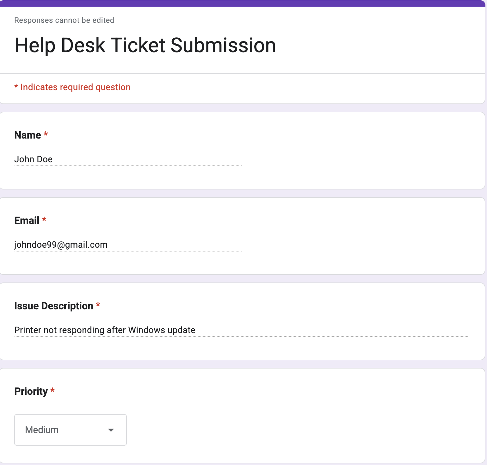
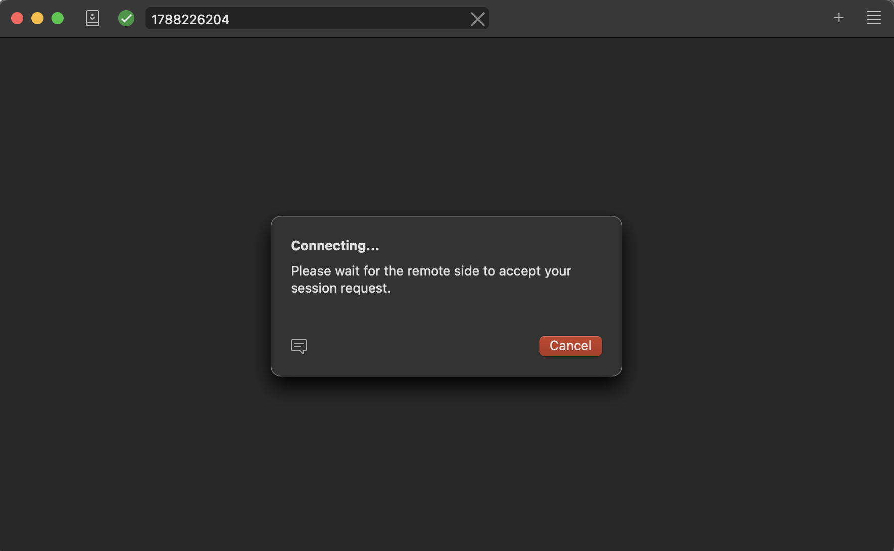
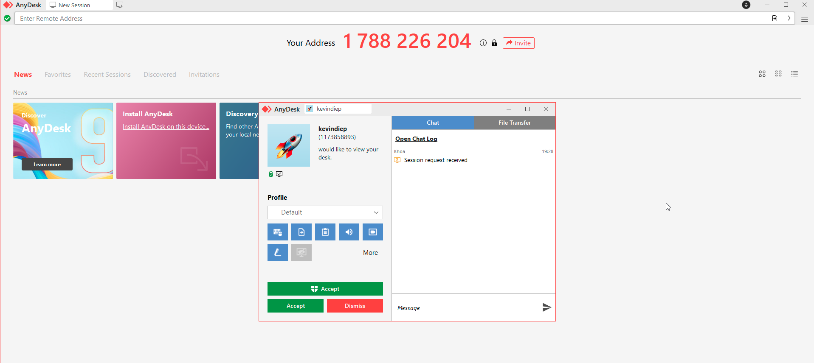
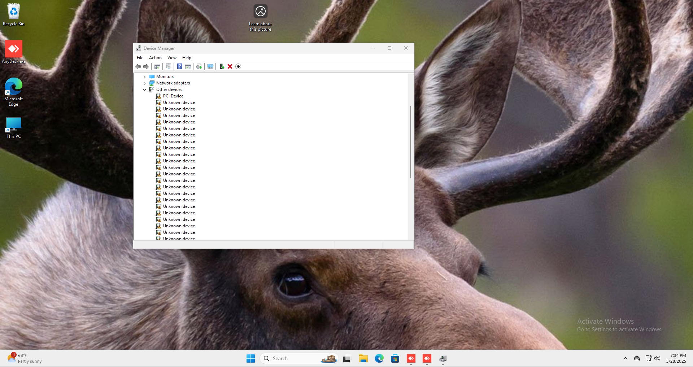
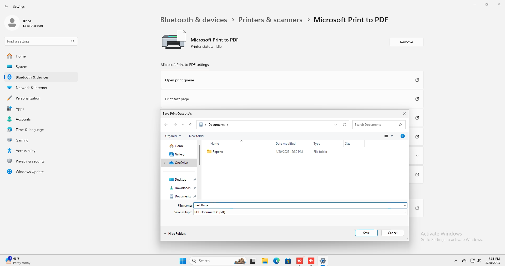
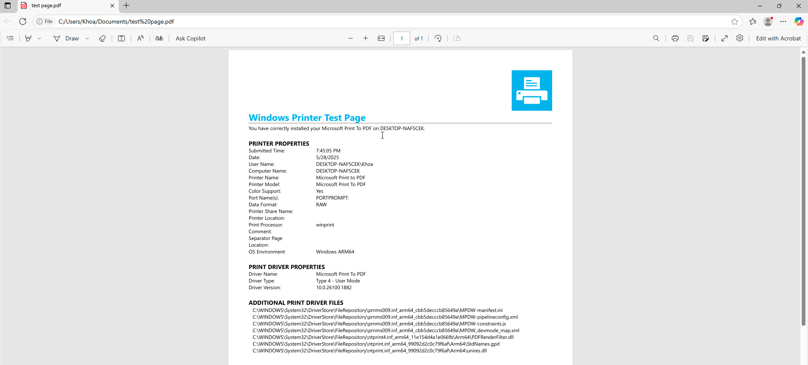
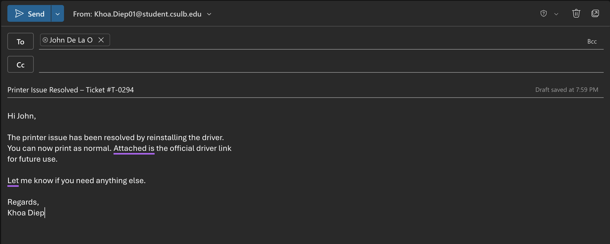

# 🖨️ Printer Issue – Remote Support Walkthrough

This walkthrough demonstrates a real-world scenario where an IT Support Specialist remotely assists a user with a printer issue following a Windows update. The support was delivered using AnyDesk, Device Manager, and secure follow-up communication.

---

## 📌 Step 1: Review Support Ticket

Before initiating the session, review the user’s ticket for context. This includes verifying the user's identity, issue summary, and confirming contact availability.

**Ticket Info**:
- **Employee Name**: John Doe  
- **Employee ID**: 123456  
- **Ticket Number**: T-0294  
- **Issue**: Printer stopped responding after Windows update

📷 *Screenshot*:

---

## 🔗 Step 2: Connect via AnyDesk

The user is asked to install AnyDesk and provide their access code. The IT support agent connects and requests permission for remote control.

📷 *Screenshot*:

---

## 🛠️ Step 3: Identify Printer Driver Issue

Once connected, the agent opens Device Manager and observes a warning icon next to the printer driver, indicating a corrupted or outdated driver.

📷 *Screenshot*:

---

## 🧪 Step 4: Test Print Page

After reinstalling the correct driver, the agent confirms resolution by printing a test page via **Devices and Printers**.

📷 *Screenshot*:

---

## 📧 Step 5: Send Follow-Up Email

Once the issue is resolved, the support agent logs the session and sends a summary email to the user, including a driver download link for future reference.

📷 *Screenshot*:

---

## ✅ Summary

This step-by-step process demonstrates how to:
- Initiate remote support securely
- Diagnose and resolve hardware issues
- Communicate effectively with end users
- Maintain professionalism and documentation

📁 All screenshots are located in:  
`demos`

---
